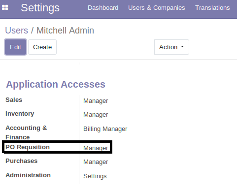

# Requisition module for Odoo 12 community

Here user can place a requisition for purchase. In the requisition from user will
get following fields
* **Product (Inventory Product reference):** Select field when user can select product from
inventory. Odoo entity reference
* **Quantity:** A text field where user can place integer number
* **Unit of measure (UOM reference):** Select field where user can select inventory’s unit of
measure.
* **Delivery date:** Odoo date field
* **Stock location (Inventory stock location reference):** Select field where user can
select Warehouse location.
* **Name:** An automated sequence number

Initially requisition is saved as draft state, when user approve that requisition by clicking a button named "Approve" a purchase order will be created in draft mode. This draft Purchase order is actually purchase order in quotation state. And later PO will be conformed by user manually.

## Settings

Don't forget to set access for **PO Requisition** for per user - 

